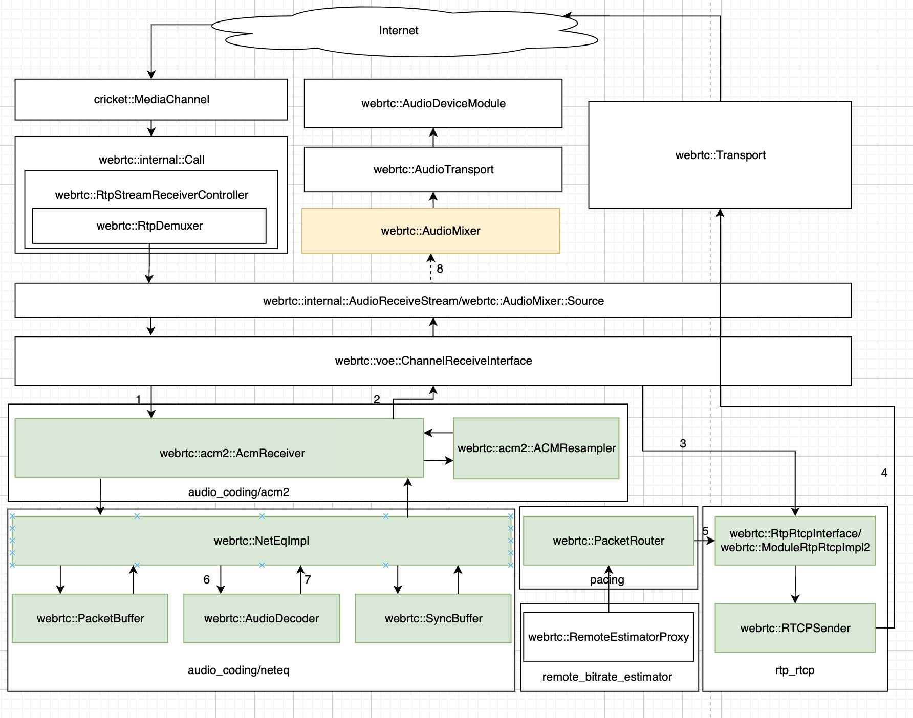
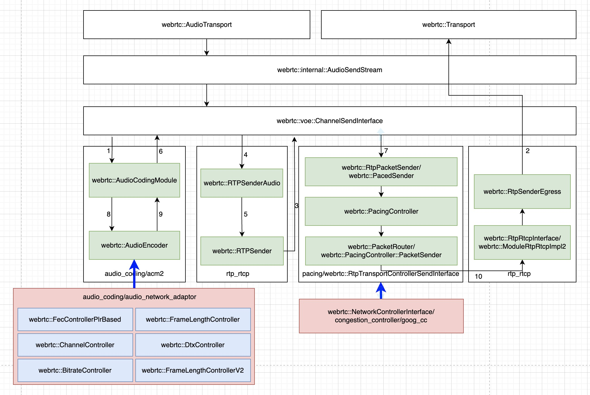

WebRTC 音频数据处理中，期望可以实现音频数据处理及传输，延时低，互动性好，声音平稳无抖动，码率低消耗带宽少等。在数据传输上，WebRTC 采用基于 UDP 的 RTP/RTCP 协议，RTP/RTCP 本身不提供数据的可靠传输及质量保障。公共互联网这种分组交换网络，天然具有数据包传输的丢失、重复、乱序及延时等问题。WebRTC 音频数据处理的这些目标很难同时实现，WebRTC 的音频网络对抗实现中针对不同情况对这些目标进行平衡。
<!--more-->
这里更仔细地看一下 WebRTC 音频数据处理管线，并特别关注与音频网络对抗相关的逻辑。

## WebRTC 的音频数据接收及解码播放控制管线

前面在 [WebRTC 的音频数据编码及发送控制管线](https://github.com/hanpfei/OpenRTCClient/blob/m98_4758/docs/webrtc_audio_encode_and_send_control_pipeline_build.md) 一文中分析了 WebRTC 的音频数据编码及发送控制相关逻辑，这里再来看一下 WebRTC 的音频数据接收及解码播放过程。

WebRTC 的音频数据接收处理的概念抽象层面的完整流程大体如下：

```
-----------------------------     --------------------------     ---------------------------
|                           |     |                        |     |                         |
| webrtc::AudioDeviceModule | <== | webrtc::AudioTransport | <== | webrtc::AudioProcessing |
|                           |     |                        |     |                         |
-----------------------------     --------------------------     ---------------------------
                                                                            / \
                                                                            ｜｜
                                          +=+===============================+=+
                                          | |
                    -------------------------------------------- 
                    |                                          |
                    |            webrtc::AudioMixer            | 
                    |                                          |
                    --------------------------------------------
                                          / \
                                          | |
-------------------------     ---------------------------------------------------------
|                       |     |                                                       |
| cricket::MediaChannel | ==> | webrtc::AudioMixer::Source/webrtc::AudioReceiveStream |
|                       |     |                                                       |
-------------------------     ---------------------------------------------------------
                                                      ｜｜
                                                      \ /
-------------------------------------------     ---------------------
|                                         |     |                   |
| cricket::MediaChannel::NetworkInterface | <== | webrtc::Transport |
|                                         |     |                   |
-------------------------------------------     ---------------------
```

对于 WebRTC 的音频数据接收处理过程，`webrtc::AudioDeviceModule` 负责把声音 PCM 数据通过系统接口送进设备播放出来。`webrtc::AudioDeviceModule` 内部一般会起专门的播放线程，由播放线程驱动整个解码播放过程。`webrtc::AudioTransport` 作为一个适配和胶水模块，它把音频数据播放和 `webrtc::AudioProcessing` 的音频数据处理及混音等结合起来，它通过 `webrtc::AudioMixer` 同步获取并混音各个远端音频流，这些混音之后的音频数据除了返回给 `webrtc::AudioDeviceModule` 用于播放外，还会被送进 `webrtc::AudioProcessing`，以作为回声消除的参考信号。`webrtc::AudioMixer::Source` / `webrtc::AudioReceiveStream` 为播放过程提供解码之后的数据。RTCP 反馈在 `webrtc::AudioMixer::Source` / `webrtc::AudioReceiveStream` 中会通过 `webrtc::Transport` 发送出去。`webrtc::Transport` 也是一个适配和胶水模块，它通过 `cricket::MediaChannel::NetworkInterface` 实际将数据包发送网络。`cricket::MediaChannel` 从网络中接收音频数据包并送进 `webrtc::AudioMixer::Source` / `webrtc::AudioReceiveStream`。

如果将音频数据接收处理流水线上的适配和胶水模块省掉，音频数据接收处理流水线将可简化为类似下面这样：

```
-----------------------------     ---------------------------
|                           |     |                         |
| webrtc::AudioDeviceModule | <== | webrtc::AudioProcessing |
|                           |     |                         |
-----------------------------     ---------------------------
                                             / \
                                             ｜｜
                    -------------------------------------------- 
                    |                                          |
                    |            webrtc::AudioMixer            | 
                    |                                          |
                    --------------------------------------------
                                          / \
                                          | |
-------------------------     ---------------------------------------------------------
|                       |     |                                                       |
| cricket::MediaChannel | ==> | webrtc::AudioMixer::Source/webrtc::AudioReceiveStream |
|                       |     |                                                       |
-------------------------     ---------------------------------------------------------
                                                      ｜｜
                                                      \ /
------------------------------------------------------------------------
|                                                                      |
|                 cricket::MediaChannel::NetworkInterface              |
|                                                                      |
------------------------------------------------------------------------
```

`webrtc::AudioMixer::Source` / `webrtc::AudioReceiveStream` 是整个过程的中心，其实现位于 `webrtc/audio/audio_receive_stream.h` / `webrtc/audio/audio_receive_stream.cc`，相关的类层次结构如下图：


在 RTC 中，为了实现交互和低延迟，音频数据接收处理不能只做包的重排序和解码，它还要充分考虑网络对抗，如 PLC 及发送 RTCP 反馈等，这也是一个相当复杂的过程。WebRTC 的设计大量采用了控制流与数据流分离的思想，这在 `webrtc::AudioReceiveStream` 的设计与实现中也有体现。分析 `webrtc::AudioReceiveStream` 的设计与实现时，也可以从配置及控制，和数据流两个角度来看。

可以对 `webrtc::AudioReceiveStream` 执行的配置和控制主要有如下这些：

 * NACK，jitter buffer 最大大小，payload type 与 codec 的映射等；
 * 配置用于把 RTCP 包发送到网络的 `webrtc::Transport` 、解密参数等；
 * `webrtc::AudioReceiveStream` 的生命周期控制，如启动停止等；

对于数据流，一是从网络中接收到的数据包被送进 `webrtc::AudioReceiveStream`；二是播放时，`webrtc::AudioDeviceModule` 从 `webrtc::AudioReceiveStream` 获得解码后的数据，并送进播放设备播放出来；三是 `webrtc::AudioReceiveStream` 发送 RTCP 反馈包给发送端以协助实现拥塞控制，对编码发送过程产生影响。

`webrtc::AudioReceiveStream` 的实现中，最主要的数据处理流程 —— 音频数据接收、解码及播放过程，及相关模块如下图：


这个图中的箭头表示数据流动的方向，数据在各个模块中处理的先后顺序为自左向右。图中下方红色的框中是与网络对抗密切相关的逻辑。

`webrtc::AudioReceiveStream` 的实现的数据处理流程中，输入数据为音频网络数据包和对端发来的 RTCP 包，来自于 `cricket::MediaChannel`，输出数据为解码后的 PCM 数据，被送给 `webrtc::AudioTransport`，以及构造的 RTCP 反馈包，如 TransportCC、RTCP NACK 包，被送给 `webrtc::Transport` 发出去。

`webrtc::AudioReceiveStream` 的实现内部，音频网络数据包最终被送进 NetEQ 的缓冲区 `webrtc::PacketBuffer` 里，播放时 NetEQ 做解码、PLC 等，解码后的数据提供给 `webrtc::AudioDeviceModule`。

### WebRTC 音频数据接收处理流水线的搭建过程

这里先来看一下，`webrtc::AudioReceiveStream` 实现的这个数据处理流水线的搭建过程。

`webrtc::AudioReceiveStream` 实现的数据处理管线是分步骤搭建完成的。我们围绕上面的 **`webrtc::AudioReceiveStream` 数据处理流程图** 来看这个过程。

在 `webrtc::AudioReceiveStream` 对象创建，也就是 `webrtc::voe::(anonymous namespace)::ChannelReceive` 对象创建时，会创建一些关键对象，并建立部分对象之间的联系，这个调用过程如下：
```
#0  webrtc::voe::(anonymous namespace)::ChannelReceive::ChannelReceive(webrtc::Clock*, webrtc::NetEqFactory*, webrtc::AudioDeviceModule*, webrtc::Transport*, webrtc::RtcEventLog*, unsigned int, unsigned int, unsigned long, bool, int, bool, bool, rtc::scoped_refptr<webrtc::AudioDecoderFactory>, absl::optional<webrtc::AudioCodecPairId>, rtc::scoped_refptr<webrtc::FrameDecryptorInterface>, webrtc::CryptoOptions const&, rtc::scoped_refptr<webrtc::FrameTransformerInterface>)
    (this=0x61b000008c80, clock=0x602000003bb0, neteq_factory=0x0, audio_device_module=0x614000010040, rtcp_send_transport=0x619000017cb8, rtc_event_log=0x613000011f40, local_ssrc=4195875351, remote_ssrc=1443723799, jitter_buffer_max_packets=200, jitter_buffer_fast_playout=false, jitter_buffer_min_delay_ms=0, jitter_buffer_enable_rtx_handling=false, enable_non_sender_rtt=false, decoder_factory=..., codec_pair_id=..., frame_decryptor=..., crypto_options=..., frame_transformer=...) at webrtc/audio/channel_receive.cc:517
#2  webrtc::voe::CreateChannelReceive(webrtc::Clock*, webrtc::NetEqFactory*, webrtc::AudioDeviceModule*, webrtc::Transport*, webrtc::RtcEventLog*, unsigned int, unsigned int, unsigned long, bool, int, bool, bool, rtc::scoped_refptr<webrtc::AudioDecoderFactory>, absl::optional<webrtc::AudioCodecPairId>, rtc::scoped_refptr<webrtc::FrameDecryptorInterface>, webrtc::CryptoOptions const&, rtc::scoped_refptr<webrtc::FrameTransformerInterface>)
    (clock=0x602000003bb0, neteq_factory=0x0, audio_device_module=0x614000010040, rtcp_send_transport=0x619000017cb8, rtc_event_log=0x613000011f40, local_ssrc=4195875351, remote_ssrc=1443723799, jitter_buffer_max_packets=200, jitter_buffer_fast_playout=false, jitter_buffer_min_delay_ms=0, jitter_buffer_enable_rtx_handling=false, enable_non_sender_rtt=false, decoder_factory=..., codec_pair_id=..., frame_decryptor=..., crypto_options=..., frame_transformer=...) at webrtc/audio/channel_receive.cc:1137
#3  webrtc::internal::(anonymous namespace)::CreateChannelReceive(webrtc::Clock*, webrtc::AudioState*, webrtc::NetEqFactory*, webrtc::AudioReceiveStream::Config const&, webrtc::RtcEventLog*) (clock=0x602000003bb0, audio_state=
    0x628000004100, neteq_factory=0x0, config=..., event_log=0x613000011f40) at webrtc/audio/audio_receive_stream.cc:79
#4  webrtc::internal::AudioReceiveStream::AudioReceiveStream(webrtc::Clock*, webrtc::PacketRouter*, webrtc::NetEqFactory*, webrtc::AudioReceiveStream::Config const&, rtc::scoped_refptr<webrtc::AudioState> const&, webrtc::RtcEventLog*) (this=
    0x61600005be80, clock=0x602000003bb0, packet_router=
    0x61c000060908, neteq_factory=0x0, config=..., audio_state=..., event_log=0x613000011f40)
    at webrtc/audio/audio_receive_stream.cc:103
#5  webrtc::internal::Call::CreateAudioReceiveStream(webrtc::AudioReceiveStream::Config const&) (this=
    0x620000001080, config=...) at webrtc/call/call.cc:954
#6  cricket::WebRtcVoiceMediaChannel::WebRtcAudioReceiveStream::WebRtcAudioReceiveStream(webrtc::AudioReceiveStream::Config, webrtc::Call*) (this=0x60b000010fd0, config=..., call=0x620000001080) at webrtc/media/engine/webrtc_voice_engine.cc:1220
#7  cricket::WebRtcVoiceMediaChannel::AddRecvStream(cricket::StreamParams const&) (this=0x619000017c80, sp=...)
    at webrtc/media/engine/webrtc_voice_engine.cc:2025
#8  cricket::BaseChannel::AddRecvStream_w(cricket::StreamParams const&) (this=0x619000018180, sp=...)
   ebrtc/pc/channel.cc:567
#9  cricket::BaseChannel::UpdateRemoteStreams_w(std::vector<cricket::StreamParams, std::allocator<cricket::StreamParams> > const&, webrtc::SdpType, std::__cxx11::basic_string<char, std::char_traits<char>, std::allocator<char> >*)
    (this=0x619000018180, streams=std::vector of length 1, capacity 1 = {...}, type=webrtc::SdpType::kOffer, error_desc=0x7ffff2387e00)
    at webrtc/pc/channel.cc:725
#10 cricket::VoiceChannel::SetRemoteContent_w(cricket::MediaContentDescription const*, webrtc::SdpType, std::__cxx11::basic_string<char, std::char_traits<char>, std::allocator<char> >*) (this=0x619000018180, content=0x6130000003c0, type=webrtc::SdpType::kOffer, error_desc=0x7ffff2387e00)
    at webrtc/pc/channel.cc:926
#11 cricket::BaseChannel::SetRemoteContent(cricket::MediaContentDescription const*, webrtc::SdpType, std::__cxx11::basic_string<char, std::char_traits<char>, std::allocator<char> >*) (this=0x619000018180, content=0x6130000003c0, type=webrtc::SdpType::kOffer, error_desc=0x7ffff2387e00)
    at webrtc/pc/channel.cc:292
```

`webrtc::AudioReceiveStream` 通过 `webrtc::Call` 创建，传入 `webrtc::AudioReceiveStream::Config`，其中包含与 NACK、jitter buffer 最大大小、payload type 与 codec 的映射相关，及 webrtc::Transport 等各种配置。

`webrtc::voe::(anonymous namespace)::ChannelReceive` 对象的构造函数如下：

```
ChannelReceive::ChannelReceive(
    Clock* clock,
    NetEqFactory* neteq_factory,
    AudioDeviceModule* audio_device_module,
    Transport* rtcp_send_transport,
    RtcEventLog* rtc_event_log,
    uint32_t local_ssrc,
    uint32_t remote_ssrc,
    size_t jitter_buffer_max_packets,
    bool jitter_buffer_fast_playout,
    int jitter_buffer_min_delay_ms,
    bool jitter_buffer_enable_rtx_handling,
    bool enable_non_sender_rtt,
    rtc::scoped_refptr<AudioDecoderFactory> decoder_factory,
    absl::optional<AudioCodecPairId> codec_pair_id,
    rtc::scoped_refptr<FrameDecryptorInterface> frame_decryptor,
    const webrtc::CryptoOptions& crypto_options,
    rtc::scoped_refptr<FrameTransformerInterface> frame_transformer)
    : worker_thread_(TaskQueueBase::Current()),
      event_log_(rtc_event_log),
      rtp_receive_statistics_(ReceiveStatistics::Create(clock)),
      remote_ssrc_(remote_ssrc),
      acm_receiver_(AcmConfig(neteq_factory,
                              decoder_factory,
                              codec_pair_id,
                              jitter_buffer_max_packets,
                              jitter_buffer_fast_playout)),
      _outputAudioLevel(),
      clock_(clock),
      ntp_estimator_(clock),
      playout_timestamp_rtp_(0),
      playout_delay_ms_(0),
      rtp_ts_wraparound_handler_(new rtc::TimestampWrapAroundHandler()),
      capture_start_rtp_time_stamp_(-1),
      capture_start_ntp_time_ms_(-1),
      _audioDeviceModulePtr(audio_device_module),
      _outputGain(1.0f),
      associated_send_channel_(nullptr),
      frame_decryptor_(frame_decryptor),
      crypto_options_(crypto_options),
      absolute_capture_time_interpolator_(clock) {
  RTC_DCHECK(audio_device_module);

  network_thread_checker_.Detach();

  acm_receiver_.ResetInitialDelay();
  acm_receiver_.SetMinimumDelay(0);
  acm_receiver_.SetMaximumDelay(0);
  acm_receiver_.FlushBuffers();

  _outputAudioLevel.ResetLevelFullRange();

  rtp_receive_statistics_->EnableRetransmitDetection(remote_ssrc_, true);
  RtpRtcpInterface::Configuration configuration;
  configuration.clock = clock;
  configuration.audio = true;
  configuration.receiver_only = true;
  configuration.outgoing_transport = rtcp_send_transport;
  configuration.receive_statistics = rtp_receive_statistics_.get();
  configuration.event_log = event_log_;
  configuration.local_media_ssrc = local_ssrc;
  configuration.rtcp_packet_type_counter_observer = this;
  configuration.non_sender_rtt_measurement = enable_non_sender_rtt;

  if (frame_transformer)
    InitFrameTransformerDelegate(std::move(frame_transformer));

  rtp_rtcp_ = ModuleRtpRtcpImpl2::Create(configuration);
  rtp_rtcp_->SetSendingMediaStatus(false);
  rtp_rtcp_->SetRemoteSSRC(remote_ssrc_);

  // Ensure that RTCP is enabled for the created channel.
  rtp_rtcp_->SetRTCPStatus(RtcpMode::kCompound);
}
```

`webrtc::voe::(anonymous namespace)::ChannelReceive` 对象的构造函数的执行过程如下：

 * 创建了一个 `webrtc::acm2::AcmReceiver` 对象，建立起了下图中标号为 **1** 和 **2** 的这两条连接；
 * 创建了一个 `webrtc::ModuleRtpRtcpImpl2` 对象，在创建这个对象时传入的 `configuration` 参数的 `outgoing_transport` 配置项指向了传入的 `webrtc::Transport`，建立起了下图中标号为 **3** 和 **4** 的这两条连接；


图中标为绿色的模块为这个阶段已经接入 `webrtc::voe::(anonymous namespace)::ChannelReceive` 的模块，标为黄色的则为那些还没有接进来的模块；实线箭头表示这个阶段已经建立的连接，虚线箭头则表示还没有建立的连接。

在 `ChannelReceive` 的 `RegisterReceiverCongestionControlObjects()` 函数中，`webrtc::PacketRouter` 被接进来：

```
#0  webrtc::voe::(anonymous namespace)::ChannelReceive::RegisterReceiverCongestionControlObjects(webrtc::PacketRouter*)
    (this=0x61b000008c80, packet_router=0x61c000060908) at webrtc/audio/channel_receive.cc:786
#1  webrtc::internal::AudioReceiveStream::AudioReceiveStream(webrtc::Clock*, webrtc::PacketRouter*, webrtc::AudioReceiveStream::Config const&, rtc::scoped_refptr<webrtc::AudioState> const&, webrtc::RtcEventLog*, std::unique_ptr<webrtc::voe::ChannelReceiveInterface, std::default_delete<webrtc::voe::ChannelReceiveInterface> >)
    (this=0x61600005be80, clock=0x602000003bb0, packet_router=0x61c000060908, config=..., audio_state=..., event_log=0x613000011f40, channel_receive=std::unique_ptr<webrtc::voe::ChannelReceiveInterface> = {...}) at webrtc/audio/audio_receive_stream.cc:130
#2  webrtc::internal::AudioReceiveStream::AudioReceiveStream(webrtc::Clock*, webrtc::PacketRouter*, webrtc::NetEqFactory*, webrtc::AudioReceiveStream::Config const&, rtc::scoped_refptr<webrtc::AudioState> const&, webrtc::RtcEventLog*)
    (this=0x61600005be80, clock=0x602000003bb0, packet_router=0x61c000060908, neteq_factory=0x0, config=..., audio_state=..., event_log=0x613000011f40)
    at webrtc/audio/audio_receive_stream.cc:98
#3  webrtc::internal::Call::CreateAudioReceiveStream(webrtc::AudioReceiveStream::Config const&) (this=0x620000001080, config=...)
    at webrtc/call/call.cc:954
```

这个操作也发生在 `webrtc::AudioReceiveStream` 对象创建期间。`ChannelReceive` 的 `RegisterReceiverCongestionControlObjects()` 函数的实现如下：

```
void ChannelReceive::RegisterReceiverCongestionControlObjects(
    PacketRouter* packet_router) {
  RTC_DCHECK_RUN_ON(&worker_thread_checker_);
  RTC_DCHECK(packet_router);
  RTC_DCHECK(!packet_router_);
  constexpr bool remb_candidate = false;
  packet_router->AddReceiveRtpModule(rtp_rtcp_.get(), remb_candidate);
  packet_router_ = packet_router;
}
```

这里 `webrtc::PacketRouter` 和 `webrtc::ModuleRtpRtcpImpl2` 被连接起来，前面图中标号为 **5** 的这条连接也建立起来了。NetEQ 在需要音频解码器时创建音频解码器，这个过程这里不再赘述。

这样 `webrtc::AudioReceiveStream` 内部的数据处理管线的状态变为如下图所示：



`webrtc::AudioReceiveStream` 的生命周期函数 `Start()` 被调用时，`webrtc::AudioReceiveStream` 被加进 `webrtc::AudioMixer`：

```
#0  webrtc::internal::AudioState::AddReceivingStream(webrtc::AudioReceiveStream*) (this=0x628000004100, stream=0x61600005be80)
    at webrtc/audio/audio_state.cc:59
#1  webrtc::internal::AudioReceiveStream::Start() (this=0x61600005be80) at webrtc/audio/audio_receive_stream.cc:201
#2  cricket::WebRtcVoiceMediaChannel::WebRtcAudioReceiveStream::SetPlayout(bool) (this=0x60b000010fd0, playout=true)
    at webrtc/media/engine/webrtc_voice_engine.cc:1289
#3  cricket::WebRtcVoiceMediaChannel::SetPlayout(bool) (this=0x619000017c80, playout=true)
    at webrtc/media/engine/webrtc_voice_engine.cc:1865
#4  cricket::VoiceChannel::UpdateMediaSendRecvState_w() (this=0x619000018180) at webrtc/pc/channel.cc:811
```

这样 `webrtc::AudioReceiveStream` 的数据处理管线就此搭建完成。整个音频数据处理管线的状态变为如下图所示：


### WebRTC 音频数据接收处理的主要过程

WebRTC 音频数据接收处理的实现中，保存从网络上接收的音频数据包的缓冲区为 NetEQ 的 `webrtc::PacketBuffer`，收到音频数据包并保存进 NetEQ 的 `webrtc::PacketBuffer` 的过程如下面这样：

```
#0  webrtc::PacketBuffer::InsertPacketList(std::__cxx11::list<webrtc::Packet, std::allocator<webrtc::Packet> >*, webrtc::DecoderDatabase const&, absl::optional<unsigned char>*, absl::optional<unsigned char>*, webrtc::StatisticsCalculator*, unsigned long, unsigned long, int)
    (this=0x606000030e60, packet_list=0x7ffff2629810, decoder_database=..., current_rtp_payload_type=0x61600005c5c5, current_cng_rtp_payload_type=0x61600005c5c7, stats=0x61600005c180, last_decoded_length=480, sample_rate=16000, target_level_ms=80)
    at webrtc/modules/audio_coding/neteq/packet_buffer.cc:216
#1  webrtc::NetEqImpl::InsertPacketInternal(webrtc::RTPHeader const&, rtc::ArrayView<unsigned char const, -4711l>)
    (this=0x61600005c480, rtp_header=..., payload=...) at webrtc/modules/audio_coding/neteq/neteq_impl.cc:690
#2  webrtc::NetEqImpl::InsertPacket(webrtc::RTPHeader const&, rtc::ArrayView<unsigned char const, -4711l>)
    (this=0x61600005c480, rtp_header=..., payload=...) at webrtc/modules/audio_coding/neteq/neteq_impl.cc:170
#3  webrtc::acm2::AcmReceiver::InsertPacket(webrtc::RTPHeader const&, rtc::ArrayView<unsigned char const, -4711l>)
    (this=0x61b000008e48, rtp_header=..., incoming_payload=...) at webrtc/modules/audio_coding/acm2/acm_receiver.cc:136
#4  webrtc::voe::(anonymous namespace)::ChannelReceive::OnReceivedPayloadData(rtc::ArrayView<unsigned char const, -4711l>, webrtc::RTPHeader const&) (this=0x61b000008c80, payload=..., rtpHeader=...) at webrtc/audio/channel_receive.cc:340
#5  webrtc::voe::(anonymous namespace)::ChannelReceive::ReceivePacket(unsigned char const*, unsigned long, webrtc::RTPHeader const&)
    (this=0x61b000008c80, packet=0x60700002b670 "\220\357\037\261\377\364ف\a\350\224\177\276", <incomplete sequence \336>, packet_length=67, header=...) at webrtc/audio/channel_receive.cc:719
#6  webrtc::voe::(anonymous namespace)::ChannelReceive::OnRtpPacket(webrtc::RtpPacketReceived const&)
    (this=0x61b000008c80, packet=...) at webrtc/audio/channel_receive.cc:669
#7  webrtc::RtpDemuxer::OnRtpPacket(webrtc::RtpPacketReceived const&) (this=0x620000001330, packet=...)
    at webrtc/call/rtp_demuxer.cc:249
#8  webrtc::RtpStreamReceiverController::OnRtpPacket(webrtc::RtpPacketReceived const&)
    (this=0x6200000012d0, packet=...) at webrtc/call/rtp_stream_receiver_controller.cc:52
#9  webrtc::internal::Call::DeliverRtp(webrtc::MediaType, rtc::CopyOnWriteBuffer, long) (this=
    0x620000001080, media_type=webrtc::MediaType::AUDIO, packet=..., packet_time_us=1654829839622021)
    at webrtc/call/call.cc:1606
#10 webrtc::internal::Call::DeliverPacket(webrtc::MediaType, rtc::CopyOnWriteBuffer, long)
    (this=0x620000001080, media_type=webrtc::MediaType::AUDIO, packet=..., packet_time_us=1654829839622021)
    at webrtc/call/call.cc:1637
#11 cricket::WebRtcVoiceMediaChannel::OnPacketReceived(rtc::CopyOnWriteBuffer, long)::$_2::operator()() const
    (this=0x606000074c68) at webrtc/media/engine/webrtc_voice_engine.cc:2229
```

播放时，`webrtc::AudioDeviceModule` 最终会向 NetEQ 请求 PCM 数据，此时 NetEQ 会从 `webrtc::PacketBuffer` 中取出数据包并解码。网络中传输的音频数据包中包含的音频采样点和 `webrtc::AudioDeviceModule` 每次请求的音频采样点不一定是完全相同的，比如采样率为 48kHz 的音频，`webrtc::AudioDeviceModule` 每次请求 10ms 的数据，也就是 480 个采样点，而 OPUS 音频编解码器每个编码帧中包含 20ms 的数据，也就是 960 个采样点，这样 NetEQ 返回 `webrtc::AudioDeviceModule` 每次请求的采样点之后，可能会有解码音频数据的剩余，这需要一个专门的 PCM 数据缓冲区。这个数据缓冲区为 NetEQ 的 `webrtc::SyncBuffer`。

`webrtc::AudioDeviceModule` 请求播放数据的大体过程如下面这样：

```
#0  webrtc::SyncBuffer::GetNextAudioInterleaved (this=0x606000062a80, requested_len=480, output=0x628000010110)
    at webrtc/modules/audio_coding/neteq/sync_buffer.cc:86
#1  webrtc::NetEqImpl::GetAudioInternal (this=0x61600005c480, audio_frame=0x628000010110, muted=0x7fffdc92a990, action_override=...)
    at webrtc/modules/audio_coding/neteq/neteq_impl.cc:939
#2  webrtc::NetEqImpl::GetAudio (this=0x61600005c480, audio_frame=0x628000010110, muted=0x7fffdc92a990, current_sample_rate_hz=0x7fffdcc933b0, 
    action_override=...) at webrtc/modules/audio_coding/neteq/neteq_impl.cc:239
#3  webrtc::acm2::AcmReceiver::GetAudio (this=0x61b000008e48, desired_freq_hz=48000, audio_frame=0x628000010110, muted=0x7fffdc92a990)
    at webrtc/modules/audio_coding/acm2/acm_receiver.cc:151
#4  webrtc::voe::(anonymous namespace)::ChannelReceive::GetAudioFrameWithInfo (this=0x61b000008c80, sample_rate_hz=48000, 
    audio_frame=0x628000010110) at webrtc/audio/channel_receive.cc:388
#5  webrtc::internal::AudioReceiveStream::GetAudioFrameWithInfo (this=0x61600005be80, sample_rate_hz=48000, audio_frame=0x628000010110)
    at webrtc/audio/audio_receive_stream.cc:393
#6  webrtc::AudioMixerImpl::GetAudioFromSources (this=0x61d000021280, output_frequency=48000)
    at webrtc/modules/audio_mixer/audio_mixer_impl.cc:205
#7  webrtc::AudioMixerImpl::Mix (this=0x61d000021280, number_of_channels=2, audio_frame_for_mixing=0x6280000042e8)
    at webrtc/modules/audio_mixer/audio_mixer_impl.cc:175
#8  webrtc::AudioTransportImpl::NeedMorePlayData (this=0x6280000041e0, nSamples=441, nBytesPerSample=4, nChannels=2, samplesPerSec=44100, 
    audioSamples=0x61c000080080, nSamplesOut=@0x7fffdc929c00: 0, elapsed_time_ms=0x7fffdc929cc0, ntp_time_ms=0x7fffdc929ce0)
    at webrtc/audio/audio_transport_impl.cc:215
#9  webrtc::AudioDeviceBuffer::RequestPlayoutData (this=0x614000010058, samples_per_channel=441)
    at webrtc/modules/audio_device/audio_device_buffer.cc:303
#10 webrtc::AudioDeviceLinuxPulse::PlayThreadProcess (this=0x61900000ff80)
    at webrtc/modules/audio_device/linux/audio_device_pulse_linux.cc:2106
```

## 再来看 WebRTC 的音频数据处理、编码和发送过程

更加仔细地审视 WebRTC 的音频数据处理、编码和发送过程，更完整地将网络对抗考虑进来， WebRTC 的音频数据处理、编码和发送过程，及相关模块如下图：



在 WebRTC 的音频数据处理、编码和发送过程中，编码器对于网络对抗起着巨大的作用。WebRTC 通过一个名为 audio network adapter (ANA) 的模块，根据网络状况，对编码过程进行调节。

pacing 模块平滑地将媒体数据发送到网络，拥塞控制 congestion control 模块通过影响 pacing 模块来影响媒体数据发送的过程，以达到控制拥塞的目的。

## WebRTC 的音频网络对抗概述

由 WebRTC 的音频采集、处理、编码和发送过程，及音频的接收、解码、处理及播放过程，可以粗略梳理出 WebRTC 的音频网络对抗的复杂机制：

 * audio network adapter (ANA)，ANA 通过根据网络状况，影响编码过程来做网络对抗，主要用在 OPUS 编码器中。ANA 可以影响编码过程的 5 个参数：
    - 带内 FEC，OPUS 编码器可以生成带内 FEC，当有丢包时，可以通过 FEC 信息部分恢复丢失的信息，尽管 FEC 的信息质量可能不是很高；用来抗丢包；
    - DTX，当要编码的数据长期为空数据时，可以生成 DTX 包来降低码率，这种机制可能会导致延迟变大；
    - 码率；
    - 帧长度，OPUS 支持从 10ms 到 120 ms 的编码帧长度；
    - 通道数。
 * pacing，数据包的平滑发送。
 * congestion_controller/goog_cc，拥塞控制探测网络状况，并通过影响 pacing 来影响发送节奏。
 * NACK，丢包时，接收端请求发送端重传部分数据包；NACK 列表由 NetEQ 维护。
 * Jitter buffer，重排序数据包，抗网络抖动。NetEQ 保存接收的音频网络数据包的地方。
 * PLC，丢包时，生成丢失的数据。由 NetEQ 执行。

没看到 WebRTC 有音频带外 FEC 机制的实现。

**参考文章**

[干货|一文读懂腾讯会议在复杂网络下如何保证高清音频](https://cloud.tencent.com/developer/article/1613289)

Done.
